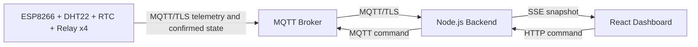

# Smart Farm Architecture

ระบบนี้แบ่งหน้าที่เป็นสามส่วนชัดเจน ได้แก่ **ESP8266 firmware**, **Backend MQTT bridge** และ **Dashboard frontend**. Frontend ไม่เชื่อมต่อ MQTT และไม่รับรู้ username/password ของ broker; Frontend รับสถานะผ่าน `GET /api/state` และ Server-Sent Events ที่ `GET /api/events` เท่านั้น.

## Data flow



Backend เป็น source of truth สำหรับสถานะการเชื่อมต่อและ state reconciliation. Snapshot ที่ Backend ประมวลผลจะถูกบันทึกลง SQLite ที่ `SMARTFARM_DB_PATH` โดยแยกตาราง telemetry, device_heartbeats และ relay_events; ไฟล์ฐานข้อมูล local ถูกกันออกจาก Git และไม่เก็บ MQTT credential. เมื่อผู้ใช้กดปุ่ม Relay ระบบจะบันทึก `desiredState` และ `pendingCommand` ก่อนส่งคำสั่ง แต่จะตั้ง `confirmedState` ก็ต่อเมื่อได้รับ MQTT status acknowledgment จาก ESP8266. หากหมดเวลา ระบบจะหยุดแสดงสถานะ pending โดยไม่เปลี่ยน confirmed state เป็นค่าที่คาดเดา.

## MQTT topic contract

| Purpose | Topic | Payload |
|---|---|---|
| Relay command | `smartfarm/relay/{1..4}/set` | `ON` or `OFF` |
| Relay confirmation | `smartfarm/relay/{name}/status` | `ON` or `OFF` |
| Sensor JSON | `smartfarm/sensor/dht22` | `{ "temperature": 29.4, "humidity": 71.2 }` |
| Heartbeat | `smartfarm/status/heartbeat` | `{ "online": true, "time": "ISO-8601", "rtc": true }` |
| Online retained state | `smartfarm/status/online` | `true` or `false` |

The backend also subscribes to the legacy DHT11 and heartbeat topics to ease migration, but new firmware should publish DHT22 topics.

## Security rules

MQTT credentials must be provided as runtime environment variables to the Backend. They must never be placed in `client/`, `VITE_*`, browser storage, query parameters, telemetry payloads, logs, Git history, or screenshots. The firmware sample contains only `CHANGE_ME` placeholders. Before production, replace the TLS `setInsecure()` placeholder with the broker CA certificate and rotate any credential that has previously been exposed.

## Run locally

```bash
cp config/.env.example .env
# Edit .env with backend-only broker values
pnpm install
pnpm build
NODE_ENV=production node dist/index.js

# หรือรัน Backend source โดยตรงหลังติดตั้ง tsx
pnpm exec tsx server/index.ts
```

In development, run the Vite dashboard and Backend according to the repository's chosen process manager. The server uses `PORT` from the runtime and does not hardcode a deployment port.
