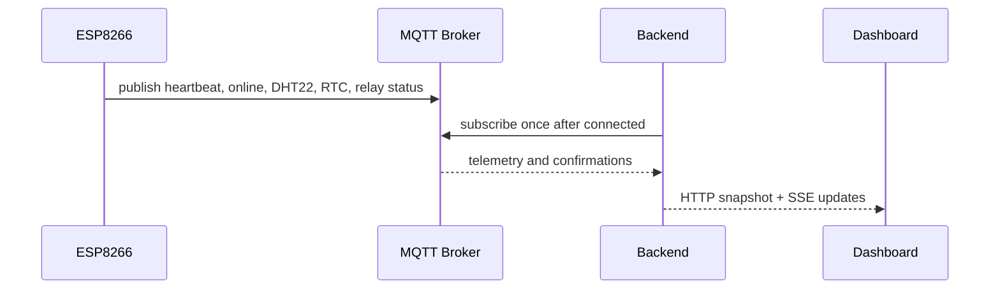

# Smart Farm MQTT Flow

ระบบใช้ MQTT Broker ผ่าน TLS ที่พอร์ต 8883 โดยค่า host, username และ password ต้องมาจาก Backend runtime environment เท่านั้น ค่า topic prefix หลักคือ `smartfarm` และห้ามส่ง credential ไปยัง Browser, Frontend bundle, log หรือ payload

## Telemetry flow

Relay commands follow a non-optimistic flow. The Dashboard sends an HTTP command to Backend, Backend publishes `smartfarm/relay/{id}/set`, ESP8266 changes the physical relay, and ESP8266 publishes the confirmed state on its status topic. The UI must keep `desiredState` and `confirmedState` separate until the acknowledgment arrives.

## Topic compatibility

| Purpose | Topic |
|---|---|
| Relay command | `smartfarm/relay/{1..4}/set` |
| Relay status | `smartfarm/relay/{id-or-legacy-name}/status` |
| Temperature | `smartfarm/sensor/temperature` |
| Humidity | `smartfarm/sensor/humidity` |
| DHT22 JSON | `smartfarm/sensor/dht22` |
| Online state | `smartfarm/status/online` |
| Heartbeat | `smartfarm/status/heartbeat` |
| RTC time | `smartfarm/rtc/time` |
| RTC date | `smartfarm/rtc/date` |

The Backend accepts numeric relay segments and known legacy names for status compatibility. New commands use numeric relay IDs.

## Reconnection rules

The Backend reports `DISCONNECTED` immediately when the MQTT client closes or errors. It reconnects with bounded exponential backoff, resets subscription state on a new client, and subscribes once per connection. The Dashboard reports `CONNECTED` only from Backend state, never from a local Browser assumption.
